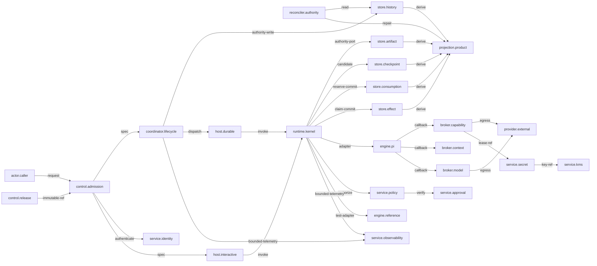

# Generic Agent Platform Runtime

Status: **draft**; admission: **blocked**.

Model digest: `sha256:830d4046e44bcef1a1aad015eaaa6d7b5e0e0131569b4e1ec11c9459b485445a`
DSL digest: `sha256:6ec4daedc6517523a77591d7ea0f6479af86665273d6fc1b3bdf33b0ffd94009`
