# Agent MVP 第一版运行时架构

- 问题：Agent Application 如何同时支持 Chat 与多环境 Temporal Task，并按可信 TaskType 自动选择 WorkflowTarget
- 来源：[`first-version-system.architecture.json#1.1`](./first-version-system.architecture.json)
- DSL：[`first-version-system.runtime.dsl.yaml`](./first-version-system.runtime.dsl.yaml)
- 渲染器：Mermaid；25 个节点等于 runtime taxonomy 上限，按固定 Layer 从左到右展示
- Renderer ID：Mermaid ID 将 DSL 的稳定 kebab-case ID 确定性转换为 snake_case，语义与关系仍以 DSL 为准

## Diagram

```mermaid
flowchart LR
  subgraph actors["Actors"]
    direction TB
    end_user["Agent Application User"]
    host_application["Host Application"]
  end

  subgraph manager["Manager"]
    direction TB
    agent_web_ui["Agent Web UI<br/>Chat + Tasks"]
    temporal_target_registry["Temporal Target Registry<br/>task type / env / namespace / queue"]
  end

  subgraph gateway["Gateway"]
    direction TB
    application_api["Application API<br/>Fastify + HTTP/SSE"]
    agent_library_api["Agent Library API<br/>LocalAgentClient"]
  end

  subgraph runtime["Runtime"]
    direction TB
    chat_service["Chat Service<br/>session / message / streaming"]
    task_service["Task Service<br/>create / query / signal / cancel"]
    task_router["Task Router<br/>resolve and pin WorkflowTarget"]
    environment_task_workers["Environment Task Workers<br/>Temporal Workflow / Activity"]
    agent_runner["Agent Runner<br/>bounded run / event / budget / cancel"]
  end

  subgraph platform["Platform"]
    direction TB
    temporal_client_adapter["Temporal Client Adapter<br/>multi-target client factory"]
    temporal_clusters["Temporal Clusters<br/>dev / prod / isolated / region"]
    pi_harness["Pi Harness Adapter<br/>HarnessPort"]
    skill_tool_runtime["Skill and Tool Runtime<br/>registry / authorize / execute"]
    credential_provider["Credential Provider<br/>connection_ref / secret_ref"]
    model_provider["LLM Provider"]
    business_tools["Business Tools<br/>and MCP Servers"]
    identity_provider["Identity Provider"]
    observability_backend["Observability Backend<br/>logs / metrics / traces"]
  end

  subgraph infrastructure["Infrastructure"]
    direction TB
    chat_store[("PostgreSQL Chat Store<br/>session / message / summary")]
    task_store[("PostgreSQL Task Store<br/>product state / routing snapshot")]
    agent_state_store[("PostgreSQL Agent State<br/>session / checkpoint")]
    artifact_store[("Artifact Store<br/>S3-compatible")]
    secret_manager["Secret Manager<br/>service and user credentials"]
  end

  end_user -->|"HTTPS · chat and task operations"| agent_web_ui
  agent_web_ui -->|"HTTP/SSE · commands and streams"| application_api
  application_api -->|"OIDC · authenticate and scope"| identity_provider
  application_api -.->|"OTLP · API telemetry"| observability_backend
  application_api -->|"in-process · chat commands"| chat_service
  application_api -->|"in-process · task commands"| task_service

  chat_service -->|"SQL · session and messages"| chat_store
  chat_service -->|"in-process · short chat run"| agent_library_api
  chat_service -->|"in-process · promote long request"| task_service
  chat_service -->|"S3 · chat attachments"| artifact_store

  task_service -->|"SQL · task product state"| task_store
  task_service -->|"S3 · task artifact read"| artifact_store
  task_service -->|"in-process · route trusted task type"| task_router
  task_router -->|"config · target policy"| temporal_target_registry
  task_router -->|"SQL · pin target snapshot"| task_store
  task_router -->|"in-process · Temporal operations"| temporal_client_adapter
  temporal_client_adapter -->|"CredentialPort · target auth"| credential_provider
  temporal_client_adapter -->|"gRPC/mTLS · selected cluster"| temporal_clusters
  temporal_clusters -.->|"Task Queue · workflow/activity task"| environment_task_workers

  environment_task_workers -->|"SQL · task projection"| task_store
  environment_task_workers -->|"SQL · session and checkpoint"| agent_state_store
  environment_task_workers -->|"S3 · results and reports"| artifact_store
  environment_task_workers -->|"in-process · agent activity"| agent_library_api
  environment_task_workers -.->|"OTLP · workflow and agent telemetry"| observability_backend

  host_application -->|"in-process · embedded agent"| agent_library_api
  agent_library_api -->|"in-process · validate and run"| agent_runner
  agent_runner -->|"HarnessPort · agent loop"| pi_harness
  agent_runner -->|"Provider Port · skill and tool"| skill_tool_runtime
  agent_runner -.->|"OTLP · agent telemetry"| observability_backend
  pi_harness -->|"HTTPS · model inference"| model_provider
  skill_tool_runtime -->|"HTTPS/MCP · authorized tool call"| business_tools
  skill_tool_runtime -->|"CredentialPort · tool credentials"| credential_provider
  credential_provider -->|"Secret API · resolve and rotate"| secret_manager

  classDef actorsClass fill:#E3F2FD,stroke:#1565C0,color:#111
  classDef managerClass fill:#BBDEFB,stroke:#1565C0,color:#111
  classDef gatewayClass fill:#90CAF9,stroke:#0D47A1,color:#111
  classDef runtimeClass fill:#C8E6C9,stroke:#2E7D32,color:#111
  classDef platformClass fill:#D1C4E9,stroke:#512DA8,color:#111
  classDef storageClass fill:#FFE0B2,stroke:#E65100,color:#111
  classDef externalClass fill:#FFCDD2,stroke:#B71C1C,color:#111

  class end_user,host_application actorsClass
  class agent_web_ui,temporal_target_registry managerClass
  class application_api,agent_library_api gatewayClass
  class chat_service,task_service,task_router,environment_task_workers,agent_runner runtimeClass
  class temporal_client_adapter,pi_harness,skill_tool_runtime,credential_provider platformClass
  class chat_store,task_store,agent_state_store,artifact_store storageClass
  class temporal_clusters,model_provider,business_tools,identity_provider,observability_backend,secret_manager externalClass
```

## Legend

- `-->`：同步 HTTP、SQL、S3、gRPC 或进程内调用
- `-.->`：异步 Temporal Task Queue 或 OTLP 遥测
- 蓝色：Actor、Manager 与 Gateway
- 绿色：在线 Runtime 与环境 Worker
- 紫色：内部 Platform Adapter
- 橙色：Chat、Task、Agent State 与 Artifact
- 红色：外部系统、Temporal Cluster 与 Secret Manager

## 关键语义

- Chat 短请求直接调用 Agent Library；长请求通过 Task Service 提升为 Temporal Task。
- Task Router 只能从受信任 Registry 选择目标，模型和普通用户不能传入 Temporal endpoint、Namespace 或 Task Queue。
- WorkflowTarget 在 Task 创建时固化；query、signal、cancel 和 retry 均复用同一目标快照。
- Temporal 拥有 Workflow History、Timer、Signal 和 Activity Retry；PostgreSQL Task Store 只保存产品状态与查询投影。
- Workflow 启动后不静默跨 Cluster 迁移；跨 Cluster 恢复需要外部 Checkpoint 和新的 Workflow。

## Review

- Checklist：pass
- Architecture Score：87/100
- Rules：architecture-skill rules version 1；规则置信度 low
- Review：[`first-version-system.architecture-review.yaml`](./first-version-system.architecture-review.yaml)
