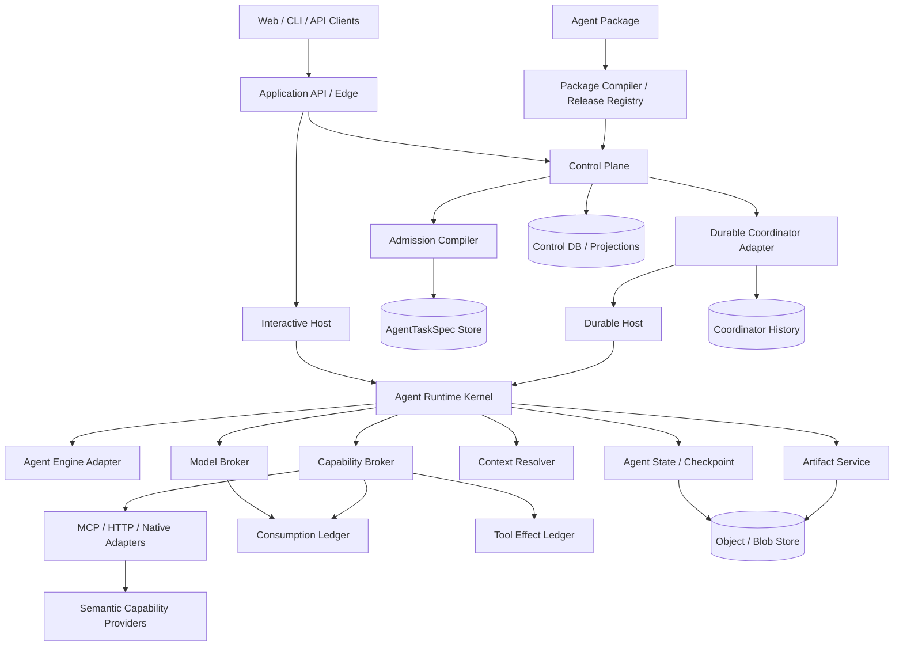

# Sage 通用 Agent 平台终版架构

- **日期**：2026-08-15
- **状态**：T0005 task-design staged baseline；待 `task-propose`
- **任务**：T0005 — 优化 Sage 通用 Agent 平台架构
- **范围**：Sage 通用 Agent 平台目标态逻辑架构
- **性质**：决策级目标方案，不代表当前实现已经具备全部能力
- **相关方**：平台架构与 Runtime Owner、Agent/API/Worker 开发者、安全与基础设施 Owner、业务 workload 接入方
- **当前实现基线**：[`first-version-system-architecture.md`](../../../../docs/design/first-version-system-architecture.md)
- **已有正式目标参考**：[`generic-agent-platform-final-architecture.md`](../../../../docs/design/_cross/generic-agent-platform-final-architecture.md)
- **现有开放问题**：[`open-questions.md`](../../../../docs/design/open-questions.md)
- **参考来源**：Sage 当前代码与设计；FAI 通用 AI 智能体平台架构仅作为逻辑架构参考，不引入其语言、框架、数据源或业务 workload 约束
- **暂存边界**：本文件当前只存在于 T0005 `design/`；正式落点已存在，`task-archive` 时合并更新/校准，不重复创建

## 1. 执行摘要

Sage 的目标不是 Package runner、DAG runner，也不是为每个业务建设一套专用 Agent 服务，而是：

> 以共享 Agent Runtime Kernel 统一平台执行语义，以可插拔 Agent Engine 承载具体认知机制，同时支持交互式与持久化运行；Package 只负责交付和版本冻结，运行时以每次执行唯一、不可变的 `AgentTaskSpec` 为配置权威，Agent 在受控 Skill、Context、Model 和 Capability/MCP 边界内自主分析、行动、观察并继续推理。

终版架构冻结以下决策：

1. **Agent-first，而非 DAG-first**：Agent 自主决定语义步骤；DAG/Workflow 只约束确定性生命周期、审批和机械执行。
2. **唯一平台执行语义**：Kernel 统一预算、事件、授权钩子、取消、Receipt、Checkpoint 和错误分类；Engine 可以拥有框架内部 loop，但不得绕过平台 Broker。
3. **Package 不是运行 authority**：Package 发布为不可变 `AgentPackageRelease`；调用时经 admission 绑定身份、输入、策略和环境，生成具体 `AgentTaskSpec`。
4. **`AgentTaskSpec` 是每次 Run/Attempt 唯一执行配置 authority**：不再引入第二份完整 Snapshot/Manifest；`AgentExecutionEnvelope` 只传 Spec 引用、digest 和稳定 ID。
5. **双 Host 复用同一 Kernel**：Interactive Host 和 Durable Host 可以独立部署、扩缩容，但不复制 Agent 语义。
6. **Durable Coordinator 只负责可靠生命周期**：当前由 Temporal Adapter 实现；Coordinator 内不执行模型、Tool、Memory、数据库或 Agent 推理。
7. **Capability authority 与 MCP 分离**：MCP 是 discovery/schema/transport adapter，不产生授权；所有 Tool 调用必须经过 Capability Broker。
8. **单一事实单一权威**：Lifecycle、预算、Tool effect、Checkpoint、Artifact、Chat、业务事实分别由明确 Store/History/Ledger 持有。
9. **状态外置、执行有界**：每个 bounded run/step 有时间、turn、token、tool、context、artifact 和 cost 上限；跨边界通过 sealed Checkpoint 恢复。
10. **框架无关以替换可证为准**：Canonical contracts 不泄漏具体 SDK 类型；至少两个 Engine Adapter 和一个 Coordinator fake 必须通过相同 conformance suite。

## 2. 背景与当前状态

Sage 当前已经具备一组可复用的可靠运行基础：

- `agent-contracts`、`agent-lib`、`agent-client` 和 `HarnessPort`；
- `tool-runtime` 的注册、授权、幂等、凭据与 `effect_unknown` 语义；
- Agent State、Artifact、Credential、Identity 等平台 Port；
- Temporal Workflow、Activity、可信多目标路由和不可变 TargetSnapshot；
- Effect Ledger、Task Projection、History reconciliation；
- Chat、Task、Provider Catalog、审计与生产准入门。

但当前实现仍有明显分裂：

- `AgentRunSpec` 与 `AgentTaskWorkflowInput` 分别描述交互运行和 durable task，没有统一执行契约；
- TaskType 是固定枚举，新 workload 仍可能要求修改平台代码；
- API/Worker 运行时没有把 ToolRuntime、AgentState、Artifact、Context 和真实 Model binding 接入同一主链路；
- `PiHarness` 是当前 Engine Adapter，但包含 provider、skill 和 checkpoint 的演示逻辑，不是通用平台终态；
- Package、Skill、Tool、Context、Model、Policy 尚未形成统一的发布、解析、锁定和 admission 流程；
- 当前架构图是 MVP 目标图，不是本终版架构的机器可校验模型。

本方案保留已有可靠外壳，不做大爆炸重写；核心改造是收敛契约、接通 Kernel/Broker/State，并逐步把当前 Temporal-specific task runtime 降为 Durable Coordinator Adapter。

## 3. 目标与非目标

### 3.1 目标

- 同一个 Agent Kernel 支持 Chat turn、短运行、长任务、周期任务、人工审批任务和后续未知 workload。
- 新 workload 通过 Package/Release、Skills、Capabilities、Schemas 和 Policies 接入，不修改 Kernel、通用 Host、通用 Run 表或 Coordinator contract。
- Agent 可以自主选择已授权 Tool，并根据 Observation 继续推理，而不是执行预定义认知 DAG。
- Interactive 与 Durable 模式具有等价的平台事件、预算、授权、错误和 Checkpoint 语义。
- 所有可漂移依赖在 admission 时固定版本或 digest；旧 Run 不因 active release、model alias 或 Registry 更新而漂移。
- Tool 写副作用、消费结算、Checkpoint 和 Artifact 在 retry/crash 下具有明确 authority 和恢复语义。
- 大数据、大输出和完整状态不进入 Prompt、普通 Event 或 Durable History，只传不可变引用和有界摘要。
- 至少两个无关 workload 共用同一套 Kernel、Host、Capability、Artifact 和 Coordinator 路径，证明通用性。

### 3.2 非目标

- 不要求所有 Agent Engine 使用相同内部 planner、reasoning trace 或文本生成方式。
- 不把全部逻辑预拆为独立微服务；逻辑边界先于物理拆分。
- 不允许 Package 动态注入未审核的原生代码、前端组件、数据库 driver 或基础设施配置。
- 不让模型直接选择 MCP endpoint、Temporal target、Secret、SQL/MQL、物理表或任意网络地址。
- 不承诺外部模型输出逐字节确定性重放；默认承诺可解释和可审计重放。
- 不在第一阶段建设 Multi-Agent 编排；单 Agent Kernel 和副作用闭环完成后再评估。
- 不以替换 Temporal 为当前目标，但 Canonical contracts 不依赖 Temporal SDK。

## 4. 方案比较与决策

以下成本、风险、复杂度与工期为相对量级，用于确定架构方向；具体人日由后续 OpenSpec change 单独估算。

| 方案 | 描述 | 交付成本 | 风险 | 复杂度 | 可逆性 | 预计工期 | 结论 |
|------|------|----------|------|--------|--------|----------|------|
| A. Package/DAG-centric | Package 编译为固定 DAG，模型作为节点 | 中 | 高：认知逻辑碎片化，新 workload 持续复制 DAG | 中 | 中：DAG 资产可保留，但迁回 Agent-first 需重构 | 首版短，长期持续增长 | 拒绝作为核心；保留为确定性子流程 |
| **B. Agent-first Kernel + Engine Adapters** | Kernel 统一平台语义，Engine 承载认知机制，Package 经 admission 编译为不可变执行 Spec | 前期高、增量中 | 中：Broker、Ledger、Checkpoint 契约必须严格一致 | 高 | **高**：Port 和 canonical contract 隔离 Engine/Coordinator | Phase 0–4 分阶段交付 | **采用** |
| C. Remote Agent Runtime per framework | 每种框架独立远程 Runtime，平台只提供 Gateway | 高 | 高：网络面、双重 retry、语义漂移和分布式事务 | 很高 | 中高：隔离强，但回收独立 Runtime 成本高 | 长 | 作为未来特殊部署模式，不作为主架构 |
| D. Temporal-centric Agent Workflow | 把 Agent step 固定成 Temporal Workflow/Activity 结构 | 短期低、长期高 | 高：Coordinator 语义泄漏，Interactive/其他 runtime 难统一 | 中高 | 低到中：核心契约会绑定 Temporal | 首版短，解耦周期长 | 仅作为 Durable Adapter 实现 |

**推荐方案：B。** 它是唯一同时保留 Agent 自主语义、复用 Sage 当前 Agent Library 与 Temporal 可靠外壳、支持框架替换，并允许分阶段迁移的方案。

接受的取舍：

- 需要新增统一 Spec、Broker、Receipt、sealed Checkpoint 和 conformance suite，短期逻辑组件数量增加；
- 不追求第一阶段物理微服务化，先以模块化单体兑现逻辑边界；
- 不承诺外部模型逐字节重放，只承诺可解释、可审计重放；
- 第一阶段不做 Multi-Agent，先闭合单 Agent 的授权、预算、副作用和恢复语义。

可逆性：Kernel 与 Engine、Coordinator 之间保持 Port 边界。如果未来出现多语言或强隔离需求，可将 Engine Adapter 移到 Remote Executor，而不改变 `AgentTaskSpec`、Capability、Receipt 和 authority 语义。

回退计划：Phase 0–2 保留现有 `AgentRunSpec.v1`、Chat 与 Temporal Task 兼容路径，并以 feature flag/双路径迁移；任一新路径未通过 conformance 或故障注入时，停止新 admission、回退旧路径，不修改已启动 Spec。已经建立的 canonical Spec、Broker Port 和 Ledger 数据继续保留，避免回退为 DAG authority。

## 5. 架构原则

### 5.1 Agent-first，但不是 Agent-only

Agent 负责理解目标、提出行动、选择语义 Tool、综合 Observation、反思和完成结果。Runtime 负责身份、授权、预算、可靠执行、状态持久化、审批、取消、重试和审计。

DAG 可以描述确定性审批、发布、迁移和批处理约束，也可以作为 Agent 调用的 Workflow Capability，但不能成为认知 authority。

### 5.2 唯一平台执行语义，认知引擎可插拔

Kernel 拥有可观察的平台行为：

- 输入和 Spec 校验；
- principal/tenant/correlation 传播；
- 预算与 deadline；
- Model/Tool/Context 只能经 Broker；
- Event/Receipt 顺序；
- 取消、暂停和稳定错误分类；
- Checkpoint 候选提交与 seal；
- Artifact/Effect/Usage Receipt 关联。

Engine Adapter 可以拥有框架特定的 planner、session 和 inner loop，但不得直接持有 Secret、最终 grant、硬预算余额、Tool effect commit、Checkpoint commit 或 durable lifecycle。

### 5.3 单一事实单一权威

Projection、cache、event、trace 和 prompt context 都不能反向成为 authority。每个事实必须在 authority matrix 中只有一个 Owner。

### 5.4 权限只能单调收窄

Admission 固化本次执行可获得的最大 Grant。运行时 revocation、emergency deny、approval expiry、scope 和剩余预算只能收窄，不能扩权或静默切换未快照 Provider。

### 5.5 状态外置、步骤有界

Host/Engine 进程不持有唯一状态。每个 bounded invocation 结束时产生 Receipt 和可选 Checkpoint candidate；只有 Store 成功持久化并 seal 后，CheckpointRef 才可用于恢复。

### 5.6 业务不污染平台 Kernel

平台只理解 Goal、Context、Skill、Capability、Artifact、Checkpoint、Budget、Policy 和 Result Schema。业务字段、状态、公式和结论位于 Package、Skill、Tool Provider 和 Artifact Schema。

### 5.7 Semantic capability 优先

Agent 优先调用版本化、强类型、有业务语义的 Tool。数据库、SQL、任意 HTTP 和物理资源访问由受信 Provider 或受控 Sandbox 封装，不直接暴露给模型。

## 6. 总体逻辑架构



这是逻辑架构，不要求第一阶段全部拆为独立服务。Control Plane Registry、Spec Store、Ledger 和 Projection 可以先共享 PostgreSQL，但表、事务、Port 和 authority 必须独立。

## 7. 分层与组件职责

| 层/组件 | 负责 | 不负责 |
|---------|------|--------|
| Experience / Edge | Web、CLI、HTTP/SSE、会话入口、认证入口 | Agent loop、Tool 授权、durable lifecycle |
| Control Plane | Package/Release、Task Definition、Policy、Schedule、Admission、查询投影 | 认知执行、业务事实、Tool effect |
| Package Compiler | Schema/依赖解析、lock、digest、签名、兼容检查 | 动态 principal、runtime target、Secret |
| Admission Compiler | 将 Release、Invocation、Identity、Policy、Model、Context、Capability、Target 绑定为 `AgentTaskSpec` | 执行 Agent 或扩权 |
| Interactive Host | 短 deadline、streaming、用户中断、Chat lifecycle | 独立 Agent 语义、durable retry |
| Durable Host | bounded invocation、heartbeat、cancel、Checkpoint/Receipt 提交 | Coordinator 决策、认知算法 |
| Durable Coordinator Adapter | timer、retry、signal、wait、continue-as-new、Task/Attempt lifecycle | 模型、Tool、Memory、数据库 I/O |
| Agent Runtime Kernel | 平台执行语义、Broker 边界、预算投影、Event/Receipt、Checkpoint 协议 | 框架专有算法、基础设施 driver |
| Agent Engine Adapter | reasoning、planning、inner loop/session mechanics | 授权、Secret、硬预算、effect/checkpoint commit |
| Model Broker | 固定 route、调用、DLP、usage receipt、fallback policy | 业务授权、最终预算余额 |
| Capability Broker | grant、scope、approval、幂等、effect、audit、usage receipt | MCP transport authority、业务数据 authority |
| Context Resolver | 按 ContextPlan 解析、授权、裁剪、快照和 provenance | 长期事实 authority |
| Artifact Service | 不可变大结果、ACL、digest、lineage、原子发布 | 业务事实和 Run lifecycle |
| Checkpoint Store | 持久化、seal、兼容校验、签发 CheckpointRef | 自主生成认知内容 |
| Consumption Ledger | token/cost/tool quota 等硬预算 reservation/commit/release | Agent 本地计数、普通性能指标 |
| Tool Effect Ledger | 写副作用 invocation、commit/unknown、稳定 replay | Tool 业务实现 |
| Projection Store | 产品查询视图、stale 标记、reconciliation | 推进 durable lifecycle |

## 8. 核心领域模型

### 8.1 AgentPackage 与 AgentPackageRelease

```text
AgentPackage {
  metadata
  agent_definition
  skills[]
  capability_requirements[]
  context_plan
  model_requirements
  input_schema
  output_schema
  policies
  budgets
  eval_cases[]
  optional_plan_hints[]
}
```

Package 是声明式交付源，不是执行 authority。默认不允许动态原生代码、远程 include、SQL/MQL、物理 endpoint、Secret 或自定义前端组件。

Compiler 生成：

```text
AgentPackageRelease {
  release_id
  package_id
  version
  owner
  engine_compatibility
  kernel_contract_major
  skill_snapshot_digests[]
  capability_requirement_digest
  context_plan_digest
  model_requirement_digest
  input_schema_digest
  output_schema_digest
  policy_digest
  default_budget_digest
  content_digest
  provenance_ref
  signature_ref
  created_at
}
```

Release 不可变；任何内容变化生成新 Release。

### 8.2 AgentTaskSpec：唯一执行配置 authority

Package build 不能直接得到具体执行 Spec，因为 principal、input、环境和 policy 仍未知。调用时由 Admission Compiler 将 Release 与 Invocation 绑定，生成每个 Run/Attempt 唯一、不可变的 `AgentTaskSpec`：

```text
AgentTaskSpec {
  schema_version
  spec_id
  task_id
  run_id
  attempt_id

  provenance {
    package_release_ref
    package_release_digest
    compiler_version
    admission_policy_digest
  }

  goal {
    instruction_ref
    input_refs[]
    input_schema_digest
    output_schema_digest
  }

  agent {
    kernel_contract_major
    engine_adapter_ref
    engine_adapter_digest
    skill_snapshot_refs[]
  }

  model_route_snapshot {
    primary_model_build
    ordered_fallback_model_builds[]
    parameters_digest
    data_handling_policy_digest
  }

  context_plan_snapshot {
    source_grants[]
    resolver_versions[]
    revision_policy
    max_context_bytes
  }

  capability_grant_snapshot {
    allowed_tool_versions[]
    provider_build_digests[]
    principal_scope
    tenant_scope
    environment
    read_write_classification
    approval_policy_digest
  }

  execution_policy {
    mode: INTERACTIVE | DURABLE
    bounds
    checkpoint_policy_digest
    completion_policy_digest
    runtime_profile_ref
    routing_snapshot_ref?
  }

  budget {
    hard_limits
    ledger_account_ref
    initial_reservation_ref
  }

  governance {
    tenant_id
    principal_ref
    data_classification
    residency
    retention_policy_digest
  }

  content_digest
  admitted_at
}
```

`AgentTaskSpec` 不包含：

- `remaining_budget`；权威余额来自 Consumption Ledger；
- Secret bytes、Token 或 Credential；
- MCP endpoint、数据库、表、Temporal namespace/task queue；
- 完整 Context、Checkpoint body 或大输入正文；
- 可变 `latest` alias；
- 模型或 Package 自报的身份和角色。

当 model、grant、context revision policy、target、runtime compatibility 或语义配置发生变化时，必须创建新 Attempt 和新 Spec；delivery retry 继续使用原 Spec。

### 8.3 AgentExecutionEnvelope

Envelope 只是传输壳，不是第二配置 authority：

```text
AgentExecutionEnvelope {
  schema_version
  spec_ref
  spec_digest
  task_id
  run_id
  attempt_id
  invocation_id
  checkpoint_ref?
  correlation
}
```

Host、Queue 和 Coordinator 只传 Envelope；消费者必须从 Spec Store 加载并校验 digest。

### 8.4 AgentRun、InteractiveSession 与 durable Task

```text
InteractiveSession {
  session_id
  tenant_id
  message_store_ref
  status: ACTIVE | CLOSED | EXPIRED
}

AgentRun {
  run_id
  task_id
  attempt_id
  spec_ref
  mode: INTERACTIVE | DURABLE
  current_checkpoint_ref?
  result_artifact_refs[]
}
```

- Chat Session lifecycle 由 Chat Store 持有。
- Interactive AgentRun lifecycle 由 Agent Run Journal 持有，承诺低延迟和诚实失败，不伪装 durable。
- Durable Task/Attempt lifecycle 由 Coordinator History 持有。
- Chat 提升 durable 时创建新的 durable Run/Attempt，只传 immutable input/checkpoint refs；原 interactive Run 必须结束或暂停，不能双跑。

### 8.5 AgentState、RunReceipt 与 Checkpoint

```text
AgentState {
  schema_version
  goal
  plan?
  current_intent?
  observation_refs[]
  evidence_refs[]
  tool_receipt_refs[]
  model_message_refs[]
  output_draft_ref?
  local_consumption_projection
}

BoundedRunReceipt {
  invocation_id
  spec_digest
  outcome
  event_range
  model_receipts[]
  capability_receipts[]
  usage_receipts[]
  effect_receipts[]
  checkpoint_ref?
  result_artifact_refs[]
  actual_host_build_attestation
}
```

Engine 可以产生 Checkpoint candidate，只有 Checkpoint Store 完成 body、digest、tenant ACL、schema、engine/runtime compatibility、receipt lineage 和 seal 后，才签发可恢复的 CheckpointRef。

## 9. Package 编译与 Run Admission

### 9.1 发布流水线

```text
Package Source
  → schema validation
  → dependency/version resolution
  → capability/model/context compatibility check
  → policy static analysis
  → eval/golden test
  → content lock + digest
  → SBOM/provenance/signature
  → immutable AgentPackageRelease
```

普通 Package 只能声明 Skill、Prompt、Schemas、Capability requirements、Context plan、Policies、Budgets 和 View metadata。可执行 Provider/Adapter 走独立受信供应链、签名、扫描和隔离部署。

### 9.2 Admission 流水线

```text
Untrusted Invocation
  → authenticate principal
  → resolve immutable Release
  → validate input refs and tenant ACL
  → resolve exact Engine/Model/Skill/Context/Capability/Runtime versions
  → evaluate policy and approval prerequisites
  → reserve initial hard budget
  → choose trusted execution target
  → write immutable AgentTaskSpec
  → return spec ref/digest
```

Admission 失败时不创建可运行 Envelope。Registry、Policy、Model、Capability、Target 或 Ledger 不可用时默认 fail closed；只读 Interactive 场景的有限降级必须由显式 policy 允许。

## 10. Agent Runtime Kernel 与 Engine Adapter

### 10.1 Kernel contract

```text
run_bounded(
  spec,
  state,
  model_broker,
  capability_broker,
  context_resolver,
  checkpoint_port,
  artifact_port,
  budget_projection,
  cancellation
) -> BoundedRunResult
```

Canonical bounded outcome：

```text
CONTINUE
COMPLETED
FAILED
WAITING_FOR_USER
WAITING_FOR_APPROVAL
PAUSED
CANCELLED
EFFECT_UNKNOWN
```

每次 invocation 必须限制：

```text
max_duration
max_engine_turns
max_model_calls
max_tool_calls
max_tokens
max_context_bytes
max_artifact_bytes
max_cost
max_concurrency
```

### 10.2 Engine contract

Engine Adapter 获得 Goal、Context view、Skill snapshot 和平台提供的受控 callbacks。它可以实现：

- Observe/Reason/Plan/Act/Reflect；
- 框架特定 session；
- 内部 planner 或短 inner loop；
- Tool proposal 和 structured output。

它不能：

- 直接访问 Model provider 或 MCP connection；
- 自行认定 Tool 已授权或副作用已提交；
- 自行签发 CheckpointRef；
- 持有跨 retry 的硬预算余额；
- 修改 Spec、principal、tenant、target 或 grant；
- 直接推进 durable Task lifecycle。

Pi 是第一个 Engine Adapter，不是平台语义本身。终版验收必须增加一个 deterministic reference Engine，证明 contract 可替换。

### 10.3 标准事件

平台至少定义：

```text
run.started
context.resolved
engine.turn.started
model.requested / model.completed / model.failed
tool.proposed / tool.denied / tool.started / tool.observed / tool.effect_unknown
approval.requested / approval.resolved
checkpoint.sealed
run.waiting / run.continued / run.completed / run.failed / run.cancelled
```

Event 只携带安全、有界 metadata 和 refs；reasoning trace 默认不作为公共契约，也不要求跨 Engine 等价。

## 11. 双 Host 与 Durable Coordinator

### 11.1 Interactive Host

负责 Chat/API/SSE、短 deadline、用户中断和 Interactive Run Journal。它调用同一 Kernel，使用同一 Spec/Broker/Event/Checkpoint contract。API 进程重启时可以诚实标记短 Run 失败并允许 retry；需要后台继续、长等待、高风险 Tool 或审批时必须提升 durable。

### 11.2 Durable Host

负责 Coordinator Activity/Job poller、bounded invocation、heartbeat、cancel、Receipt/Checkpoint 提交和 workload identity。它不实现第二套 planner/tool loop。

### 11.3 Durable Coordinator Port

Canonical domain contract 只表达：

```text
start / dispatch / wait / signal / pause / resume / cancel / retry / timeout / continue
```

Temporal workflow、signal/query、Build ID 和 History 类型只存在于 Adapter。当前 Temporal Adapter 的确定性边界保持不变：Coordinator code 中禁止 Model、Capability、Context、Memory、数据库和随机外部 I/O。

Durable lifecycle authority 是 Coordinator History。Worker 只能提交 immutable Run/Effect/Usage/Checkpoint receipts；Task Store status 是 projection，不能反向推进 lifecycle。

### 11.4 Retry 语义

- Queue/Activity delivery retry：同 Attempt、同 Spec、同稳定 invocation ID。
- Agent semantic retry：新 invocation，通常仍在同 Attempt，必须复用已提交 Effect/Usage receipts。
- 改变 model/grant/target/runtime 或从不可兼容 Checkpoint 恢复：新 Attempt、新 Spec。
- `EFFECT_UNKNOWN`：停止自动重试，进入人工 resolution protocol。

## 12. Capability Plane 与 MCP

### 12.1 Capability Broker

每次 Tool 调用的有效权限：

```text
Spec Grant Snapshot
∩ live deny/revocation overlay
∩ principal/tenant/resource scope
∩ approval scope and expiry
∩ current ledger budget
```

任何依赖不可用或校验不通过时 fail closed。Live overlay 只能撤权或 kill，不能加入新 Tool、Provider 或 Scope。

### 12.2 MCP 定位

```text
Agent Engine
  → Kernel Capability callback
  → Capability Broker
  → MCP / HTTP / Native / Sandbox Adapter
  → Semantic Capability Provider
```

MCP discovery 和 schema metadata 只描述能力，不产生 grant。MCP 新增 Tool 后，已 admission 的 Spec 不能自动获得该 Tool。

### 12.3 Tool 分类

1. **Semantic tools**：业务语义、强类型、首选。
2. **Bounded generic tools**：浏览器、文件、代码检索等，在受控 sandbox/egress 中执行。
3. **Infrastructure tools**：SQL、数据库 driver、任意 shell、任意 HTTP，默认不向 Agent 暴露；必须由受信 Provider 封装或经高等级审批。

### 12.4 Tool Effect Ledger

Tool Runtime 是执行与 enforcement 组件；Effect Ledger 是写副作用结果 authority。

稳定身份：

```text
semantic_action_id = hash(
  tenant,
  task,
  attempt-compatible-action-key,
  tool-version,
  canonical-input-digest
)
```

相同 action/digest replay 返回已提交结果；不同 digest conflict；无法确认结果时写入 `EFFECT_UNKNOWN`，禁止自动重试。

Approval 必须绑定 tenant、principal、tool/provider version、规范化参数 digest、risk、scope 和 expiry；任一变化都要求重新批准。

## 13. Model Plane

Kernel 只通过 Model Broker 调用模型。Broker 负责：

- Spec 固定的 primary + ordered fallback；
- 精确 provider/model build 或可获得的 revision/fingerprint；
- 参数、structured output、timeout、rate limit、circuit breaker；
- 数据分级、region、no-training/no-retention、DLP；
- 稳定 invocation ID 与 usage receipt；
- trace 和安全审计。

动态 alias 或未快照 fallback 不得用于已 admission 的 Spec。紧急撤权可以阻断某 route，但不能静默加入新 route。

外部 Provider 无法提供 immutable revision 时，只承诺 forensic reproducibility：记录 request ID、resolved model identity、参数、adapter build 和 non-exact reason，不承诺相同文本输出。

## 14. Context、Memory、Artifact 与 Checkpoint

### 14.1 Context

区分：

- `ContextPlanSnapshot`：允许从哪些来源、按何规则解析；
- `ContextSnapshot/Receipt`：某次 invocation 实际解析了哪些版本和 refs；
- Prompt/engine view：有界临时投影，不是 authority。

Context Resolver 负责 tenant ACL、source revision、裁剪、摘要、去重、token/byte budget、sensitivity 和 provenance。外部内容一律视为不可信，不能改变身份、grant、target 或 policy。

### 14.2 Memory

- Working Memory：当前 AgentState/Checkpoint；
- Episodic Memory：历史经验，可检索但不是业务事实；
- Curated Facts：经可信 pipeline 或人工审核晋升的长期知识。

Memory 必须 tenant/namespace 隔离，并包含 ACL、provenance、sensitivity、TTL 和 embedding model version。第一阶段可只实现 Working Memory，不把长期 Memory 放进最小 Kernel 必选路径。

### 14.3 Artifact

Artifact 保存输入快照、大 Tool Result、Evidence、结构化结果和派生 View。Artifact Service 负责 ACL、digest、lineage、retention 和原子 commit。

禁止先生成 `artifact://` 引用再假设对象存在。只有 body 与 metadata commit 成功后才返回 ArtifactRef；跨存储提交使用 temporary object + finalize/outbox + reconcile。

### 14.4 Checkpoint

Checkpoint 至少绑定 tenant、task/run/attempt、sequence、AgentState schema、Engine codec、runtime compatibility、Spec digest、input/evidence digest、Effect/Usage receipt lineage、sensitivity 和 retention。

Resume 必须校验 ACL、digest、sequence、schema 和 compatibility；不兼容时稳定失败或执行显式 migration，不能猜测恢复。

## 15. Consumption Ledger

Consumption Ledger 只承载需要硬约束或结算的维度，例如 token、模型 cost、Tool quota、受控数据量和 Run cost。普通延迟、吞吐和诊断指标留给 telemetry。

流程：

```text
reserve(invocation_id, upper_bound)
  → Model/Capability executes
  → immutable usage receipt
  → commit(invocation_id, receipt_digest, actual)
  → release/expire unused reservation
```

相同 receipt replay 不重复结算；不同 digest conflict；orphan reservation 必须可回收和审计。Spec 只保存硬上限、account/ref 和 initial reservation，不保存 remaining balance。Retry/resume 前从 Ledger 读取权威余额；Kernel 本地计数只是本次 invocation 的 fail-fast projection。

## 16. 状态权威矩阵

| 事实 | 唯一 authority | 其他形态 |
|------|----------------|----------|
| Package Release | Release Registry（内容寻址、签名） | cache |
| 每次 Run/Attempt 执行配置 | AgentTaskSpec Store | Envelope/cache |
| Policy/Capability 定义 | Control Plane Registry | Spec 固化版本 |
| 本次执行最大授权集合 | AgentTaskSpec Grant Snapshot | Engine tool descriptors |
| 紧急撤权 | Revocation Plane | authorization receipt |
| Interactive Session/message | Chat Store | UI cache/context view |
| Interactive Run lifecycle/result | Agent Run Journal | Chat timeline |
| Durable Task/Attempt lifecycle、timer、retry、cancel | Coordinator History | Task projection |
| Bounded invocation 结果 | Run Receipt / Agent State Store | Coordinator 中 receipt ref |
| Agent 认知恢复状态 | sealed Checkpoint Store | Spec/History 只存 ref/digest |
| Tool 写副作用结果 | Tool Effect Ledger | audit/event/projection |
| token/cost/quota 余额 | Consumption Ledger | Kernel counters/metrics |
| 大输入、Evidence、Result | Artifact Store | Event/History 中 ref |
| Secret bytes | Secret Manager | 其他系统只存 ref |
| 业务事实 | 业务源系统 | Tool response/Artifact snapshot |
| 产品查询状态 | Projection Store | 可从 authority 重建 |

Projection 必须显式显示 fresh/stale/unavailable。命令请求状态与生效状态分离，例如 `CANCEL_REQUESTED` 不等于 `CANCELLED`。

## 17. 安全模型

### 17.1 身份链

```text
human/service principal
  → invocation authentication
  → admission
  → AgentTaskSpec principal/tenant scope
  → workload identity
  → per-call authorization
```

模型、Package、Skill、MCP metadata 和 Tool output 不能提供或覆盖 principal/tenant scope。

### 17.2 供应链

- Package Release、Engine Adapter、Provider、Model Adapter 必须有签名、provenance、SBOM、漏洞和 license 检查；
- 未签名、签名无效、已撤销或不满足策略的 Release 不得 admission；
- 普通 Package 不允许原生代码；未来允许 WASM/脚本时必须独立 trust tier 和 sandbox；
- Registry rollback 只影响新 Attempt，不修改已启动 Spec。

### 17.3 运行隔离

- tenant-bound refs 与服务端 ACL；合法 URI 不能替代授权；
- Secret scope、短期 lease、使用后清零；
- network egress allowlist、SSRF 和 DNS rebinding 防护；
- 文件系统、CPU、内存、并发、进程和时间限制；
- 不可信代码只在独立 sandbox，不在 Host 进程中执行；
- Artifact/Checkpoint/Spec/Ledger 加密、KMS scope、审计保留与 legal hold；
- Prompt injection、Tool metadata poisoning 和 Memory poisoning 防护；
- model、provider、tool、release、tenant 级 kill switch。

## 18. 运行链路

### 18.1 Interactive

```text
Client
  → Chat message commit
  → Admission creates INTERACTIVE AgentTaskSpec
  → Interactive Host loads Spec
  → Kernel resolves Context
  → Engine proposes Model/Tool actions
  → Brokers execute and return receipts/observations
  → Kernel streams safe events
  → Result/Checkpoint committed
  → Chat timeline references Run/Artifacts
```

### 18.2 Durable

```text
Trigger/API/Schedule
  → Admission creates DURABLE AgentTaskSpec
  → Coordinator starts Task/Attempt
  → dispatch bounded invocation Envelope
  → Durable Host loads Spec + sealed Checkpoint
  → Kernel/Engine/Brokers execute
  → commit Effect/Usage/Artifact/Checkpoint receipts
  → return CONTINUE/WAIT/terminal receipt
  → Coordinator retry/wait/continue-as-new/complete
  → Projection reconciles from History + receipts
```

Coordinator History 只保存 stable IDs、refs、digests、有界状态和 command result，不保存完整 Prompt、Context、Tool body、Checkpoint body 或大模型输出。

## 19. 失败语义

| 失败 | 处理 |
|------|------|
| duplicate invocation | 稳定 invocation ID 返回同一 Receipt 或进行中状态 |
| Model 超时/无效输出 | bounded retry；记录 usage/attempt receipt；耗尽后稳定失败 |
| Capability policy/approval denial | 不调用 Provider，记录结构化 denial |
| Tool 写结果未知 | Effect Ledger 记 `EFFECT_UNKNOWN`，停止自动 retry，等待 resolution |
| Artifact commit 前崩溃 | temporary body 不可见；retry/reconcile |
| Artifact commit 后响应丢失 | 根据 commit receipt 返回同一 ArtifactRef |
| Checkpoint body/metadata/seal 部分失败 | 不发布可恢复 ref；reconcile/cleanup |
| Ledger commit 响应丢失 | receipt digest 幂等查询/commit，不重复结算 |
| Context/Memory 不可用 | 按 Spec policy fail、wait 或有限降级；不得伪造完整上下文 |
| Coordinator unavailable | 已持久 Task 等待恢复；不在另一 target 静默重复启动 |
| Projection 漂移 | History/Receipt authority 重建，API 返回 stale |
| Interactive Host 崩溃 | 消息保留，短 Run 诚实失败；用户 retry 或提升 durable |
| pause/cancel race | requested/effective 分离；已提交 Effect/Checkpoint 不回滚 |

跨 Artifact、Effect、Usage、Checkpoint 的提交不是一个全局事务；通过稳定 ID、fencing、outbox、receipt 和 reconciliation 收敛，不宣称 exactly-once。

## 20. 版本、兼容与重放

每次终态生成的 `FinalizedRunAuditRecord`（只读事后审计记录，不是执行配置 authority）必须记录：

- Package Release、Spec digest、Compiler；
- Kernel contract major、Engine/Model/Capability/Context adapter builds；
- Skill、Tool schema、Provider build、Policy、Runtime profile；
- 实际 Host build attestation；
- Coordinator workflow/run/build refs；
- Context、Model、Capability、Effect、Usage、Artifact 和 Checkpoint receipts；
- non-exact replay reasons。

兼容规则：

- Canonical schema 使用显式 major version、reader/writer compatibility 和弃用窗口；
- AgentState/Checkpoint 兼容同时检查 schema、Engine codec 和 runtime contract；
- semantic 变化必须新 Attempt；兼容安全 patch 通过显式 compatible build policy 发布；
- Durable Adapter 必须对观察窗口内旧 History 做 replay gate；
- 已启动 Spec 不因 Registry active version、model alias 或 worker image 更新而漂移；
- 默认承诺 explainable replay，不承诺模型逐字节复现。

## 21. 部署与扩缩容

第一阶段建议维持模块化单体/少量部署单元：

```text
agent-web
agent-api
  ├── Interactive Host
  ├── Control Plane
  ├── Admission Compiler
  └── logical Registries
agent-worker
  ├── Durable Host
  └── Coordinator Adapter worker
postgresql
  ├── control/spec/projection
  ├── agent state/checkpoint metadata
  └── effect/consumption ledgers
artifact/object store
external model/capability/identity/secret systems
```

逻辑边界必须先独立，物理服务只在负载、团队 Owner、安全域或故障域证据充分时拆分。

扩缩容维度：

- Interactive Host：连接数、首 token 延迟、并发 Run；
- Durable Host：queue backlog、schedule-to-start、bounded invocation latency；
- Model Broker：token/provider 并发和 rate limit；
- Capability Provider：QPS、数据量、外部系统容量；
- Artifact/Checkpoint：写吞吐、对象量、恢复延迟；
- Ledger：reservation/commit TPS、热点 account；
- Admission：tenant fairness、并发配额和 backpressure。

生产前必须定义副本、故障域、PITR、RTO/RPO、drain、stuck run、orphan reservation/lease cleanup 和 retry storm 防护。

## 22. 可观测性

统一关联：

```text
tenant_id
session_id?
task_id
run_id
attempt_id
spec_id
invocation_id
engine_turn_id?
model_call_id?
tool_call_id?
semantic_action_id?
artifact_id?
checkpoint_id?
workflow_id?
```

高基数 ID 进入 trace/log/audit，不作为 metrics label。指标至少覆盖 admission、queue、step、model、tool、effect_unknown、approval、budget、checkpoint、artifact、projection、reconcile 和 provider health。

必须能回答：

- 本次执行使用了哪个 Release、Spec、Engine、Model、Skill、Tool 和 Policy；
- 为什么允许/拒绝某次 Tool；
- 为什么 retry、从哪个 Checkpoint 恢复；
- 哪次 Effect/Usage Receipt 生效；
- 哪个 authority 决定最终状态；
- 哪些原因导致结果不可精确复现。

## 23. Sage 现有模块映射

| 现有模块 | 终版角色 | 演进方向 |
|----------|----------|----------|
| `agent-contracts` | Canonical Agent contracts | 增加 AgentTaskSpec、Envelope、Event/Receipt；保留 v1 兼容 |
| `agent-lib` | Agent Runtime Kernel | 从简单 turn loop 演进为 Broker/Receipt/Checkpoint 约束的 bounded kernel |
| `harness-pi` | 第一个 Agent Engine Adapter | 移除平台 authority；Model/Tool/Checkpoint 走 Kernel callback |
| `agent-client` | Host→Kernel binding | 同时服务 Interactive/Durable Host |
| `tool-runtime` | Capability Broker 基础 | 接入 MCP/HTTP/native adapters、Effect Ledger、approval/revocation |
| `platform-ports` | Canonical Port 集合 | 增加 Context、Model、Ledger、Spec/Checkpoint seal ports |
| `agent-state-postgres` | Agent State/Checkpoint/Run Receipt Store | 接入主运行链路，明确 seal/compatibility |
| `temporal-workflows` | Durable Coordinator Adapter | 只保存确定性 lifecycle 和 refs |
| `temporal-routing/registry` | Runtime Target Adapter/Registry | 从业务 TaskType 解耦，消费 trusted runtime requirements |
| `task-store-postgres` | Durable projection + Effect Ledger 基础 | lifecycle status 降为 projection；Effect authority 独立 |
| `chat-domain` | Interactive Session/Message authority | Chat→durable 只传 immutable refs |
| `provider-catalog` | Model Registry 输入之一 | 与实际 Model Broker route snapshot 接通 |
| `app-contracts` | Experience API contracts | 不作为 Kernel/Coordinator canonical authority |
| `local-fakes` | Conformance/fault-injection adapters | 扩展 deterministic Engine/Coordinator/Ledger fake |

## 24. 迁移策略

### Phase 0：契约和 authority 收敛

- 冻结 `AgentTaskSpec`、Envelope、Receipt、Checkpoint seal 和 authority matrix；
- `AgentRunSpec.v1` 保留为兼容 DTO/单次 bounded invocation 输入，不再是完整配置 authority；
- 建立 deterministic Engine 与 Coordinator fake conformance suite；
- 现有 Chat/Task 行为不变，可回退到旧路径。

### Phase 1：Kernel 主链路闭合

- 把 ToolRuntime、真实 Model binding、Context Resolver、AgentState、Artifact 和 Checkpoint 接入 Kernel；
- Pi Adapter 只能经 Kernel callbacks 使用外部能力；
- 先解决 Artifact 悬空引用、Checkpoint seal 和 Tool effect authority；
- 通过 feature flag 在本地/Interactive 路径影子验证。

### Phase 2：Durable Adapter 泛化

- Temporal Workflow 改为消费 Spec ref/Envelope 和 bounded receipt；
- durable lifecycle 只由 History 推进，Task Store 严格投影；
- 接入 reconciliation、continue-as-new、版本 replay 和 Worker deployment gate；
- 双路径期间同一 Task 只允许一个 lifecycle owner。

### Phase 3：Package/Release 与 Admission

- 引入 Package schema、Compiler、Release Registry、lock/signature/provenance；
- 从固定 TaskType 迁移到 Release + runtime requirements；
- 新 workload 走 Package/Spec，旧 API 经 compatibility adapter 生成等价 Spec；
- Registry rollback 只影响新 Attempt。

### Phase 4：生产治理

- 接入 OIDC/workload identity、Secret Manager、RLS/ACL、revocation、approval、sandbox/egress；
- Consumption Ledger、Effect Ledger、Artifact/Checkpoint reconciliation 生产化；
- 完成 HA、备份恢复、SLO、容量、公平性、灾备和三方准入。

迁移遵循“先契约、再接线、后泛化、最后重命名/拆分”，避免先建设大量空 Registry 或微服务。

## 25. 验收标准

### 25.1 通用性与框架替换

1. 新增第二个无关 workload 时，只新增 Package/Release、Skills、Capabilities、Schemas、Policies 和 Views，不修改 Kernel、Host、通用 Run 表和 canonical API。
2. Pi Adapter 与 deterministic reference Engine 通过同一 conformance suite：budget、cancel、event order、Broker、Receipt、Checkpoint seal 和 error taxonomy。
3. Interactive 与 Durable Host 对同一 Spec 产生等价的平台事件、预算和错误语义，不要求模型文本相同。
4. Canonical packages 静态扫描不出现具体 Engine、Temporal、Web、数据库或 MCP SDK 类型。

### 25.2 Spec、authority 与一致性

5. `AgentTaskSpec` 内容寻址且不可修改；Envelope 修改配置字段无效，因为其只允许 ref/digest/IDs。
6. 改变 model、grant、context revision policy、target 或语义 runtime 时产生新 Attempt/Spec。
7. 删除全部 projection 后可以从 Coordinator History、Run/Effect/Usage receipts 重建；projection 不能推进 lifecycle。
8. Spec 不包含 remaining budget；retry/resume 总是从 Ledger 读取权威余额。
9. 同一 usage invocation 重投递 100 次最多结算一次；orphan reservation 可回收并审计。
10. 同一写 Tool invocation 重投递不重复已知副作用；未知结果稳定进入 `EFFECT_UNKNOWN`。

### 25.3 安全

11. 未 grant、tenant/scope mismatch、approval digest mismatch/expired、policy/ledger unavailable、live revoked 的 Tool 调用全部 fail closed。
12. MCP discovery 新增 Tool 后，未重新 admission 的 Spec 无法调用。
13. Secret、完整 Context、Checkpoint body、大 Tool/Model output 不进入 Coordinator History、普通 Event、Trace 或 projection。
14. Artifact/Checkpoint/Spec ref 跨 tenant 读取被拒绝；合法 URI 本身不能越权。
15. 未签名、签名无效、已撤销或 provenance 不合格的 Release/Adapter 无法 admission。
16. 未授权 egress、私网地址和 DNS rebinding 被阻断。

### 25.4 Checkpoint、恢复与版本

17. Checkpoint 只有在 body、digest、receipt lineage 和 seal 成功后可见；故障注入不得产生悬空可恢复 ref。
18. Resume 校验 tenant、digest、sequence、schema、Engine codec 和 runtime compatibility；不兼容时稳定失败或走显式 migration。
19. 新 Worker/build 能 replay 支持窗口内旧 Coordinator History；失败时发布被阻断。
20. Registry rollback 不修改已启动 Spec；实际 Host/Adapter/Provider identity 写入 Receipt。
21. Chat→durable 后原 interactive Run 明确结束或暂停，不存在两个 lifecycle owner。

### 25.5 运行与灾备

22. 每次 bounded invocation 的 duration、turn、model、tool、token、context、artifact、cost 和 concurrency 上限均可自动测试。
23. pause/cancel race 中 requested/effective 状态正确，已提交 Effect/Checkpoint 不回滚。
24. Coordinator、DB、Artifact、Secret/Policy、Model、Tool、Ledger 故障均有明确 fail/wait/stale 行为和告警。
25. queue saturation/provider rate limit 下 admission backpressure 和 tenant fairness 生效，无 retry storm。
26. 完成备份恢复和 RTO/RPO 演练；恢复后 Spec、Checkpoint、Effect/Usage Receipt digest 可校验并对账。
27. Coordinator History、Event、Trace 和 metrics cardinality 有自动上限；大 payload 一律转 Artifact ref。

## 26. 已拒绝的设计

- **固定 Package/DAG 作为认知 authority**：拒绝；只保留为交付、约束和确定性子流程。
- **Chat 与 Durable 各自实现 Agent loop**：拒绝；统一 Kernel/Engine contract。
- **Kernel 强制实现唯一 planner 算法**：拒绝；会排斥自带 loop 的 Agent framework。平台统一可观察语义而非内部思维过程。
- **每种 framework 独立远程 Runtime**：暂不采用；仅在多语言或强隔离成为硬需求时启用 Remote Executor。
- **MCP discovery 自动授权**：拒绝；MCP 只做协议适配。
- **Agent 直接访问 SQL/数据库/任意 HTTP**：拒绝；使用 semantic Provider 或受控 Sandbox。
- **多个完整 Spec/Snapshot/Manifest 并存**：拒绝；`AgentTaskSpec` 是唯一配置 authority，Envelope 只传引用。
- **CheckpointRef 由 Engine 自行生成**：拒绝；只能由 Checkpoint Store seal 后签发。
- **Projection 与 Coordinator 双主**：拒绝；Projection 可丢弃重建。
- **先拆大量微服务再接线**：拒绝；逻辑模块化优先。

## 27. 架构不变量

1. `AgentTaskSpec` 是每次 Run/Attempt 唯一执行配置 authority。
2. Package/Release 不能直接控制 runtime target、identity、Secret 或 live grant。
3. Kernel 是平台执行语义的单一实现；Engine 不能绕过 Broker/Ledger/Checkpoint commit。
4. Interactive 与 Durable Host 不复制平台 Agent 语义。
5. Durable Coordinator 中不存在 Model、Tool、Context、Memory 或数据库 I/O。
6. MCP discovery/schema 不等于 Capability grant。
7. 权限在 admission 后只能单调收窄。
8. Durable lifecycle 只属于 Coordinator History；Task Store 是 projection。
9. Tool 写副作用只属于 Effect Ledger；`EFFECT_UNKNOWN` 不自动重试。
10. 硬预算余额和结算只属于 Consumption Ledger。
11. Checkpoint 只有 seal 后才可恢复；Engine 不签发 CheckpointRef。
12. Secret bytes 只属于 Secret Manager；其他系统只保存受限引用。
13. 业务类型、状态和公式不进入 Kernel。
14. Coordinator History 不携带大正文或完整 Context。
15. 所有可漂移依赖在 admission 固定版本/digest；旧 Spec 不静默漂移。
16. 默认承诺 explainable replay，不承诺模型逐字节确定性。

## 28. 已决定与开放问题

### 28.1 已决定

- Agent-first shared Kernel + pluggable Engine Adapter；
- `AgentPackageRelease → AgentTaskSpec → AgentExecutionEnvelope` 三层契约；
- `AgentTaskSpec` 每 Run/Attempt 唯一且不可变；
- 双 Host 共用 Kernel；Temporal 是当前 Durable Coordinator Adapter；
- Capability Broker 是授权 authority，MCP 只是 adapter；
- Effect/Consumption/Checkpoint/Lifecycle 单一 authority；
- Package 默认声明式，不允许普通 Package 动态注入代码；
- 先模块化单体，按证据拆服务；
- 第一阶段不做 Multi-Agent。

### 28.2 仍需环境/产品 Owner 决定

这些问题不改变核心架构，但会影响生产实现：

- 首批允许的 Engine 范围：仅 TypeScript 进程内，还是预留 Remote/Multi-language；
- Package 是否在未来允许 WASM/脚本，以及对应 trust tier；
- Consumption Ledger 是内部 quota、showback 还是真实 billing；
- Interactive Run 的最大时长和强制 durable promotion 条件；
- Checkpoint 跨 Engine major 的 migration Owner；
- Artifact、Checkpoint、Spec、Audit、Ledger 的 retention/legal-hold 联动；
- 生产 SLO、最大 Task 时长、单租户并发、容量阈值、RTO/RPO 和跨区策略；
- Runtime Target Registry、Policy/Approval、Secret Manager 和 Artifact backend 的具体产品选型。

## 29. 文档关系与后续

本文件是 Sage 通用 Agent 平台的目标态终版提案。接受后：

- 它将取代 [`first-version-system-architecture.md`](../../../../docs/design/first-version-system-architecture.md) 作为长期目标架构；
- 现有 v1.1 文档继续作为当前 MVP 实现基线和迁移证据，不删除、不改写历史；
- 新终版 System Model、Runtime DSL 和 Formal Architecture Review 应基于本文件另行生成；在这些机器产物通过 Formal Gate 前，本文件状态保持 `Proposed final architecture baseline`；
- 具体代码变更、实施任务和发布 Gate 由后续 OpenSpec change 承载，不在本文创建实现任务。

## 30. 任务暂存与交接

本文件是 T0005 的决策级设计快照，当前不写实现代码、不创建 OpenSpec change，也不直接改写正式设计资产。

| 文档角色 | 类型 | 目标仓 | 计划归档路径 | 归档动作 |
|----------|------|--------|--------------|----------|
| 终版系统架构主设计 | design | `.` | `docs/design/_cross/generic-agent-platform-final-architecture.md` | 与已有正式目标参考合并更新/校准，不创建重复文档 |

- **暂存索引**：[`README.md`](./README.md)
- **下一步**：`/task-propose T0005`，按 Phase 0–4 和依赖关系拆分可独立验收、回滚的 OpenSpec changes。
- **未决问题**：集中保留在“28.2 仍需环境/产品 Owner 决定”；这些问题不改变推荐方案和 16 条架构不变量。
- **正式基线升级条件**：生成新的 System Model、Runtime DSL 和 Formal Architecture Review，并通过相应 Gate。

